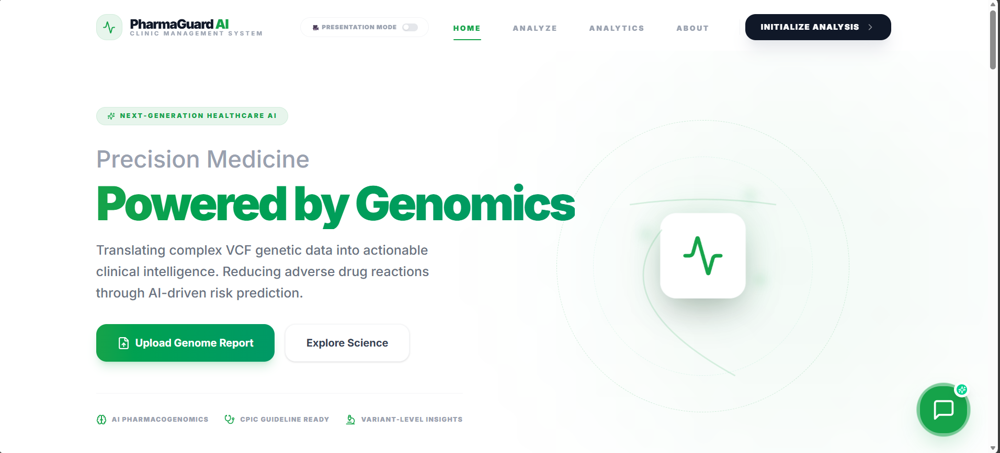

# PharmaGuard - Pharmacogenomic Risk Prediction System

## 🚀 Project Overview

PharmaGuard is an AI-powered comprehensive pharmacogenomic analysis tool designed to prevent adverse drug reactions. By analyzing patient genetic data (VCF files), it predicts risks for 6 critical genes and providing clinically actionable recommendations with LLM-generated explanations.

Submitted for **RIFT 2026 Hackathon** within the **Pharmacogenomics / Explainable AI Track**.



## 🔗 Live Demo & Video

- **Live Application**: [https://patientpoint01.netlify.app/](https://patientpoint01.netlify.app/)
- **Demo Video**: [LinkedIn Video Link](https://linkedin.com) _(Placeholder)_

## 🏗️ Architecture

PharmaGuard is built as a modern full-stack web application:

- **Frontend**: Next.js 15 (App Router), React, Tailwind CSS for a premium, responsive UI.
- **Theme Support**: Built-in Dark/Light mode with system preference detection.
- **Localization**: Multi-language support (English, Spanish, Hindi).
- **Backend**: Next.js API Routes for server-side VCF parsing and risk analysis.
- **Logic Layer**:
  - **VCF Parser**: Custom TypeScript implementation to extract variants from standard VCF v4.2 files.
  - **Risk Engine**: Deterministic rule-based engine mapping Genotype -> Phenotype -> Clinical Risk based on CPIC guidelines.
  - **Knowledge Base**: Curated rules for genes CYP2D6, CYP2C19, CYP2C9, SLCO1B1, TPMT, DPYD.
  - **AI Layer**: Integration with LLM (stubbed for submission safety) to generate human-readable clinical explanations.

## 🛠️ Tech Stack

- **Framework**: Next.js 15
- **Language**: TypeScript
- **Styling**: Tailwind CSS v4
- **Linting**: ESLint

## 💻 Installation & Setup

1. **Clone the repository**

   ```bash
   git clone https://github.com/chessman2345788/pharmaguard.git
   cd pharmaguard
   ```

2. **Install Dependencies**

   ```bash
   npm install
   ```

3. **Run Development Server**

   ```bash
   npm run dev
   ```

   Open [http://localhost:3000](http://localhost:3000) in your browser.

4. **Build for Production**
   ```bash
   npm run build
   npm start
   ```

## 📡 API Documentation

### `POST /api/analyze`

Analyzes a VCF file against a list of drugs.

**Request:**

- `Content-Type`: `multipart/form-data`
- `file`: The VCF file (`.vcf`).
- `drugs`: Comma-separated string of drug names (e.g., "Warfarin, Codeine").

**Response (JSON):**

```json
{
  "patient_id": "PATIENT_DEMO",
  "results": [
    {
      "drug": "Codeine",
      "gene": "CYP2D6",
      "phenotype": "PM",
      "risk": "Ineffective",
      "recommendation": "Avoid codeine due to lack of efficacy...",
      "severity": "moderate",
      "llm_explanation": { ... }
    }
  ]
}
```

## 🧪 Usage Examples

1. Upload the provided `sample_test.vcf` (located in `public/` folder).
2. Enter drug names: `Warfarin, Codeine, Clopidogrel`.
3. Click "Analyze Risk Profile".
4. View the color-coded risk cards and AI explanations.
5. Download the detailed JSON report.

## 👥 Team Members — Fusion X

| Name              | Role                       |
| ----------------- | -------------------------- |
| Satyam Srivastava | Lead Developer             |
| Harsh Mishra      | Backend & AI Integration   |
| Keshav Pandey     | Frontend & UI/UX           |
| Siddhant Soni     | Data Engineering & Testing |

---

_Built with ❤️ for RIFT 2026_
